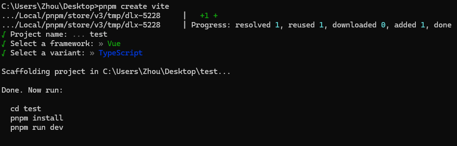
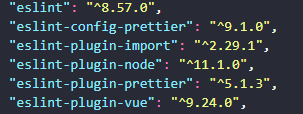
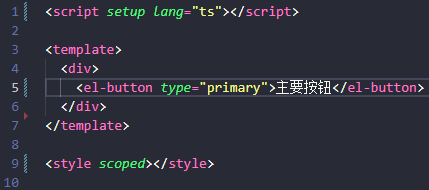
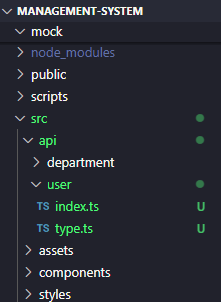
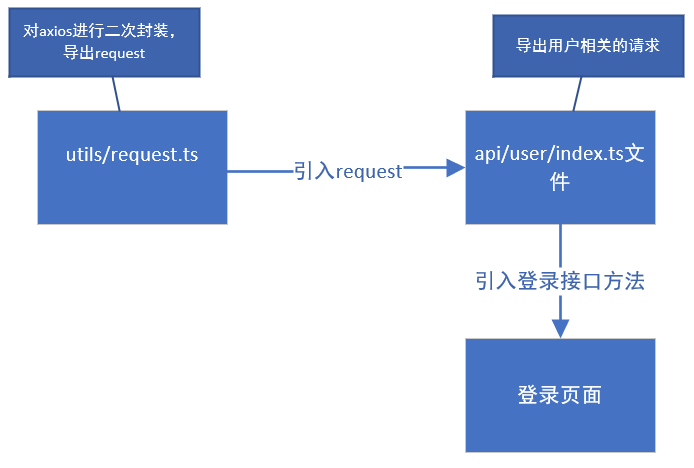
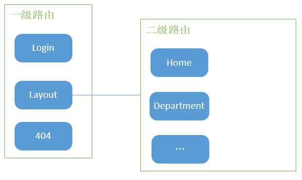
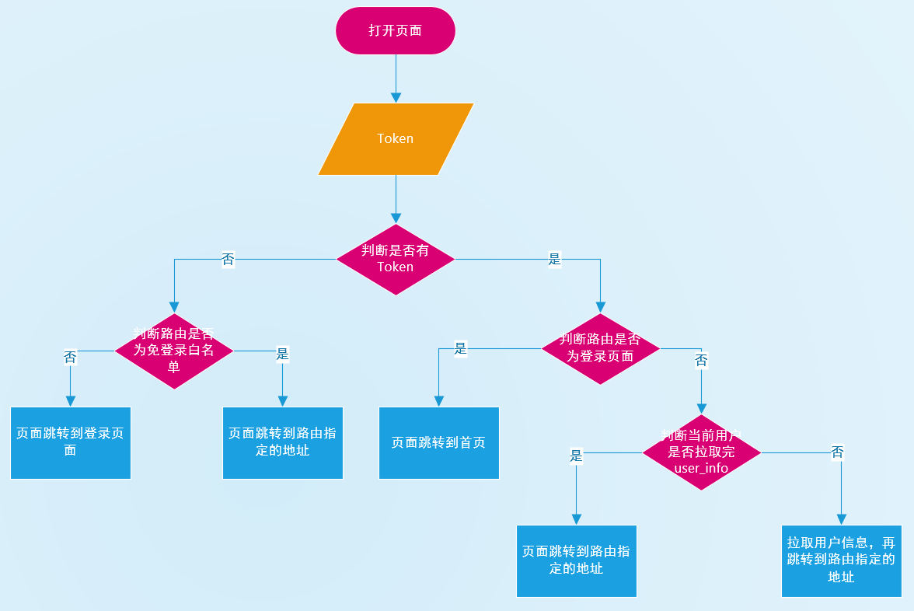

# 5月15日

### 一、chore: 搭建项目

查看vite官方文档[开始 | Vite 官方中文文档 (vitejs.cn)](https://vitejs.cn/vite3-cn/guide/#scaffolding-your-first-vite-project)，根据官方给出的步骤来搭建项目

第一步：

```
pnpm create vite // 在终端中输入这段代码
```

第二步：

根据命令提示符，选择所需要的配置



> [!IMPORTANT]
>
> 项目搭建完成，还需要使用`pnpm i`指令下载node_modules文件夹才能运行

### 二、配置eslint

查看eslint中文文档[ESLint 入门 - ESLint - 插件化的 JavaScript 代码检查工具](https://zh-hans.eslint.org/docs/latest/use/getting-started)，根据官方给出的步骤来配置eslint

> [!NOTE]
>
> 使用eslint的目的是在于根据项目需求进行配置，帮助团队维持一致的代码风格，并且可以在代码编写过程中提供实时反馈

第一步：

```
pnpm i eslint -D // 在终端中输入这段代码，先别着急，这段代码需要修改，在下面会说
```

第二步：

```
npm init @eslint/config // 在终端中输入这段代码
```

在运行 `npm init @eslint/config` 后，你的目录下会有 `.eslintrc.{js,yml,json}` 文件

第三步：

```
pnpm install -D eslint-plugin-import eslint-plugin-vue eslint-plugin-node eslint-plugin-prettier eslint-config-prettier eslint-plugin-node @babel/eslint-parser // 在终端中输入这段代码
```

下载相关插件

第四步：

将你的目录下会有 `.eslintrc.{js,yml,json}` 文件内容修改为如下的内容：

```
// @see https://eslint.bootcss.com/docs/rules/

module.exports = {
  env: {
    browser: true,
    es2021: true,
    node: true,
    jest: true,
  },
  /* 指定如何解析语法 */
  parser: 'vue-eslint-parser',
  /** 优先级低于 parse 的语法解析配置 */
  parserOptions: {
    ecmaVersion: 'latest',
    sourceType: 'module',
    parser: '@typescript-eslint/parser',
    jsxPragma: 'React',
    ecmaFeatures: {
      jsx: true,
    },
  },
  /* 继承已有的规则 */
  extends: [
    'eslint:recommended',
    'plugin:vue/vue3-essential',
    'plugin:@typescript-eslint/recommended',
    'plugin:prettier/recommended',
  ],
  plugins: ['vue', '@typescript-eslint'],
  /*
   * "off" 或 0    ==>  关闭规则
   * "warn" 或 1   ==>  打开的规则作为警告（不影响代码执行）
   * "error" 或 2  ==>  规则作为一个错误（代码不能执行，界面报错）
   */
  rules: {
    // eslint（https://eslint.bootcss.com/docs/rules/）
    'no-var': 'error', // 要求使用 let 或 const 而不是 var
    'no-multiple-empty-lines': ['warn', { max: 1 }], // 不允许多个空行
    'no-console': process.env.NODE_ENV === 'production' ? 'error' : 'off',
    'no-debugger': process.env.NODE_ENV === 'production' ? 'error' : 'off',
    'no-unexpected-multiline': 'error', // 禁止空余的多行
    'no-useless-escape': 'off', // 禁止不必要的转义字符

    // typeScript (https://typescript-eslint.io/rules)
    '@typescript-eslint/no-unused-vars': 'error', // 禁止定义未使用的变量
    '@typescript-eslint/prefer-ts-expect-error': 'error', // 禁止使用 @ts-ignore
    '@typescript-eslint/no-explicit-any': 'off', // 禁止使用 any 类型
    '@typescript-eslint/no-non-null-assertion': 'off',
    '@typescript-eslint/no-namespace': 'off', // 禁止使用自定义 TypeScript 模块和命名空间。
    '@typescript-eslint/semi': 'off',

    // eslint-plugin-vue (https://eslint.vuejs.org/rules/)
    'vue/multi-word-component-names': 'off', // 要求组件名称始终为 “-” 链接的单词
    'vue/script-setup-uses-vars': 'error', // 防止<script setup>使用的变量<template>被标记为未使用
    'vue/no-mutating-props': 'off', // 不允许组件 prop的改变
    'vue/attribute-hyphenation': 'off', // 对模板中的自定义组件强制执行属性命名样式
  },
}

```

> [!NOTE]
>
> 在这个文件里面，配置的rules是一些常见的规则

第五步：

在项目目录下，新建`.eslintignore`文件，内容如下

```
dist
node_modules
```

第六步：

在`package.json`文件的scripts配置项中添加如下代码

```
"scripts": {
    "lint": "eslint src",
    "fix": "eslint src --fix",
}
```

> [!WARNING]
>
> 在第一步`pnpm i eslint -D`下载的eslint版本是9.0.0，在9.0.0的版本中，按照如上的步骤配置会报错（`pnpm run lint`不能正常运行），从 ESLint v9.0.0 开始，`.eslintrc` 配置格式已经被弃用（deprecated），取而代之的是 flat config（扁平配置）系统成为新的默认配置系统。（我太菜了，不知道他在讲什么>.<`)
>
> 参考如下：
>
> [Bug: "Error: Could not find config file." · Issue #18287 · eslint/eslint (github.com)](https://github.com/eslint/eslint/issues/18287)
>
> 反正我只知道，9.0.0的版本就是用不了，然后我就查看了我三周前的一个练习项目的`package.json`文件，如下图所示
>
> 
>
> 然后我运行了`pnpm i eslint@8.57.0 -D`，将eslint的版本降低到了8.57.0，然后`pnpm run lint`就能正常运行，能够检查代码了

### 三、配置prettier

> [!NOTE]
>
> prettier是代码格式化工具，配置它的目的是用于自动格式化代码，使其符合统一的风格规范

第一步：

```
pnpm install -D eslint-plugin-prettier prettier eslint-config-prettier
```

安装相关的插件

第二步：

将`prettierrc.json`文件，添加如下的规则：

```
{
  "singleQuote": true,
  "semi": false,
  "bracketSpacing": true,
  "htmlWhitespaceSensitivity": "ignore",
  "endOfLine": "auto",
  "trailingComma": "all",
  "tabWidth": 2
}
```

第三步：

将`prettierignore`文件添加如下的内容：

```
{
  "singleQuote": true,
  "semi": false,
  "bracketSpacing": true,
  "htmlWhitespaceSensitivity": "ignore",
  "endOfLine": "auto",
  "trailingComma": "all",
  "tabWidth": 2
}
```

按照上述的步骤配置完成之后，进行格式化代码之后，就会按照上面添加的规则进行格式化

# 5月16日

### 一、配置styleLint

官方文档[Home | Stylelint中文文档 | Stylelint中文网 (bootcss.com)](https://stylelint.bootcss.com/)

> [!NOTE]
>
> 配置styleLint的目的是规避 CSS 代码中的错误并保持一致的编码风格

第一步：

安装如下的依赖：

```
pnpm add sass sass-loader stylelint postcss postcss-scss postcss-html stylelint-config-prettier stylelint-config-recess-order stylelint-config-recommended-scss stylelint-config-standard stylelint-config-standard-vue stylelint-scss stylelint-order stylelint-config-standard-scss -D
```

第二步：

在项目目录下，新建一个`.stylelintrc.cjs`的配置文件，文件内容如下：

```
// @see https://stylelint.bootcss.com/

module.exports = {
  extends: [
    'stylelint-config-standard', // 配置stylelint拓展插件
    'stylelint-config-html/vue', // 配置 vue 中 template 样式格式化
    'stylelint-config-standard-scss', // 配置stylelint scss插件
    'stylelint-config-recommended-vue/scss', // 配置 vue 中 scss 样式格式化
    'stylelint-config-recess-order', // 配置stylelint css属性书写顺序插件,
    'stylelint-config-prettier', // 配置stylelint和prettier兼容
  ],
  overrides: [
    {
      files: ['**/*.(scss|css|vue|html)'],
      customSyntax: 'postcss-scss',
    },
    {
      files: ['**/*.(html|vue)'],
      customSyntax: 'postcss-html',
    },
  ],
  ignoreFiles: [
    '**/*.js',
    '**/*.jsx',
    '**/*.tsx',
    '**/*.ts',
    '**/*.json',
    '**/*.md',
    '**/*.yaml',
  ],
  /**
   * null  => 关闭该规则
   * always => 必须
   */
  rules: {
    'value-keyword-case': null, // 在 css 中使用 v-bind，不报错
    'no-descending-specificity': null, // 禁止在具有较高优先级的选择器后出现被其覆盖的较低优先级的选择器
    'function-url-quotes': 'always', // 要求或禁止 URL 的引号 "always(必须加上引号)"|"never(没有引号)"
    'no-empty-source': null, // 关闭禁止空源码
    'selector-class-pattern': null, // 关闭强制选择器类名的格式
    'property-no-unknown': null, // 禁止未知的属性(true 为不允许)
    'block-opening-brace-space-before': 'always', //大括号之前必须有一个空格或不能有空白符
    'value-no-vendor-prefix': null, // 关闭 属性值前缀 --webkit-box
    'property-no-vendor-prefix': null, // 关闭 属性前缀 -webkit-mask
    'selector-pseudo-class-no-unknown': [
      // 不允许未知的选择器
      true,
      {
        ignorePseudoClasses: ['global', 'v-deep', 'deep'], // 忽略属性，修改element默认样式的时候能使用到
      },
    ],
  },
}
```

第三步：

在项目目录下，新建一个`.stylelintignore`的忽略文件，文件内容如下：

```
/node_modules/*
/dist/*
/html/*
/public/*
```

第四步：

在`package.json`文件的scripts配置项中添加如下代码：

```
"scripts": {
    "format": "prettier --write \"./**/*.{html,vue,ts,js,json,md}\"",
    "lint:eslint": "eslint src/**/*.{ts,vue} --cache --fix",
    "lint:style": "stylelint src/**/*.{css,scss,vue} --cache --fix"
  },
```

### 二、配置husky

> [!NOTE]
>
> 配置husky的目的是利用其在代码提交之前触发git hook(git在客户端的钩子)，然后执行`pnpm run format`来自动的格式化我们的代码

第一步：

```
pnpm install -D husky
```

安装husky

第二步：

```
npx husky-init
```

执行完这段代码，会生成一个`.husky`的文件夹，该文件夹下有一个`pre-commit`文件，这个文件在执行commit的时候会自动执行

第三步：

在`pre-commit`文件修改为如下：

```
#!/usr/bin/env sh
. "$(dirname -- "$0")/_/husky.sh"

pnpm run format

```

完成如上步骤，代码在进行commit操作时，会执行`pnpm run format`对代码进行格式化，然后再提交

### 三、配置commitLint

> [!NOTE]
>
> 配置commitLint的目的是在于统一commit的信息

第一步：

安装相关依赖

```
pnpm add @commitlint/config-conventional @commitlint/cli -D
```

第二步：

在项目目录下，新建`commitlint.config.cjs`文件，文件内容如下：

```
module.exports = {
  extends: ['@commitlint/config-conventional'],
  // 校验规则
  rules: {
    'type-enum': [
      2,
      'always',
      [
        'feat',
        'fix',
        'docs',
        'style',
        'refactor',
        'perf',
        'test',
        'chore',
        'revert',
        'build',
      ],
    ],
    'type-case': [0],
    'type-empty': [0],
    'scope-empty': [0],
    'scope-case': [0],
    'subject-full-stop': [0, 'never'],
    'subject-case': [0, 'never'],
    'header-max-length': [0, 'always', 72],
  },
}
```

第三步：

在`package.json`文件的scripts配置项中添加如下代码：

```
"scripts": {
  "commitlint": "commitlint --config commitlint.config.cjs -e -V"
},
```

第四步：

配置husky

```
npx husky add .husky/commit-msg
```

执行完这一步，会在`.husky`文件夹下面生成一个新的文件，名叫`commit-msg`

第五步：

在新的文件内容修改为如下：

```
#!/usr/bin/env sh
. "$(dirname -- "$0")/_/husky.sh"

pnpm commitlint

```

完成上述步骤之后，在进行commit时，需要携带如下关键字

```
'feat',//新特性、新功能
'fix',//修改bug
'docs',//文档修改
'style',//代码格式修改, 注意不是 css 修改
'refactor',//代码重构
'perf',//优化相关，比如提升性能、体验
'test',//测试用例修改
'chore',//其他修改, 比如改变构建流程、或者增加依赖库、工具等
'revert',//回滚到上一个版本
'build',//编译相关的修改，例如发布版本、对项目构建或者依赖的改动
```

### 四、配置统一包管理工具

第一步：

在项目目录下，新建文件夹`scripts`，文件夹下新建文件`preinstall.js`文件，文件内容如下：

```
if (!/pnpm/.test(process.env.npm_execpath || '')) {
  console.warn(
    `\u001b[33mThis repository must using pnpm as the package manager ` +
    ` for scripts to work properly.\u001b[39m\n`,
  )
  process.exit(1)
}
```

第二步：

在`package.json`文件的scripts配置项中添加如下代码：

```
"scripts": {
	"preinstall": "node ./scripts/preinstall.js"
}
```

### 五、集成element-plus

参照官方文档[安装 | Element Plus (element-plus.org)](https://element-plus.org/zh-CN/guide/installation.html)

第一步：

下载element-plus

```
pnpm install element-plus @element-plus/icons-vue
```

第二步：

按需引入element-plus相关的组件时，需要进行额外的插件

```
npm install -D unplugin-vue-components unplugin-auto-import
```

将下列代码插入到Vite的配置文件`vite.config.ts`中

```
import { defineConfig } from 'vite'
import AutoImport from 'unplugin-auto-import/vite'
import Components from 'unplugin-vue-components/vite'
import { ElementPlusResolver } from 'unplugin-vue-components/resolvers'

export default defineConfig({
  // ...
  plugins: [
    // ...
    AutoImport({
      resolvers: [ElementPlusResolver()],
    }),
    Components({
      resolvers: [ElementPlusResolver()],
    }),
  ],
})
```

> [!NOTE]
>
> 如何按需引入组件并使用呢？
>
> 示例：
>
> 
>
> 

### 六、配置src文件夹别名

第一步：

将下列代码插入到Vite的配置文件`vite.config.ts`中：

```
// vite.config.ts
import {defineConfig} from 'vite'
import vue from '@vitejs/plugin-vue'
import path from 'path' // 这里
export default defineConfig({
    plugins: [vue()],
    // 还有这里
    resolve: {
        alias: {
            "@": path.resolve("./src") // 相对路径别名配置，使用 @ 代替 src
        }
    }
})
```

第二步：

将下列代码插入到`tsconfig.json`文件中：

```
// tsconfig.json
{
  "compilerOptions": {
    "baseUrl": "./", // 解析非相对模块的基地址，默认是当前目录
    "paths": { //路径映射，相对于baseUrl
      "@/*": ["src/*"]
    }
  }
}
```

### 七、集成sass

> [!NOTE]
>
> 在配置styleLint时，已经安装了sass和sass-loader

我们已经集成了sass，下面我们将引入一些全局样式

第一步：

在`src`文件夹，下面新建文件夹`styles`，新建`index.scss`、`reset.scss`和`variable.scss`文件

第二步：

将[scss-reset - npm (npmjs.com)](https://www.npmjs.com/package/scss-reset?activeTab=code)的文件内容引入到`reset.scss`文件里

第三步：

在`index.scss`文件中添加如下代码：

```
@import reset.scss
```

第四步：

在`main.ts`文件中添加如下代码：

```
// 引入全局样式
import '@/styles/index.scss'
```

> [!NOTE]
>
> 在index.scss文件中，还无法使用全局样式变量，我们需要进行如下步骤：
>
> 将下列代码插入到Vite的配置文件`vite.config.ts`中：
>
> ```
> export default defineConfig({
> 	css: {
> 		preprocessorOptions: {
> 			scss: {
> 				javascriptEnabled: true,
>             	additionalData: '@import "./src/styles/variable.scss";',
>           	},
>         },
> 	},
> })
> ```

### 八、对axios进行二次封装

第一步：

```
pnpm i axios
```

第二步：

在`src`文件夹下创建`utils`文件夹，再创建`request`文件，文件内容如下：

```
// 对axios进行二次封装

import axios from 'axios'

// 引入element-plus的组件
import { ElMessage } from 'element-plus'

const request = axios.create({
  baseURL: '/api',
  timeout: 5000,
})

// 请求拦截器
request.interceptors.request.use((config) => {
  return config
})

// 响应拦截器
request.interceptors.response.use(
  // 响应成功回调
  (response) => {
    // 用于处理（简化数据）请求返回的数据
    return response.data
  },
  // 响应失败回调
  (error) => {
    ElMessage({
      type: 'error',
      message: '请求错误',
    })
    return Promise.reject(error)
  },
)

export default request

```

# 5月19日

### 一、配置环境变量

第一步：

在项目目录下，创建文件`.env.development`，文件内容如下：

```
# 变量必须以 VITE_ 为前缀才能暴露给外部读取
NODE_ENV = 'development'
VITE_APP_TITLE = '人力资源后台管理系统'
VITE_APP_BASE_API = '/dev-api'
VITE_SERVE = 'http://xxx.com'
```

第二步：

在项目目录下，创建文件`.env.production`，文件内容如下：

```
NODE_ENV = 'production'
VITE_APP_TITLE = '人力资源后台管理系统'
VITE_APP_BASE_API = '/prod-api'
VITE_SERVE = 'http://yyy.com'
```

第三步：

在项目目录下，创建文件`.env.test`，文件内容如下：

```
NODE_ENV = 'test'
VITE_APP_TITLE = '人力资源后台管理系统'
VITE_APP_BASE_API = '/test-api'
VITE_SERVE = 'http://zzz.com'
```

第四步：

在`package.json`文件的scripts配置项中添加如下代码：

```
 "scripts": {
    "build:test": "vue-tsc && vite build --mode test",
    "build:pro": "vue-tsc && vite build --mode production",
  },
```

完成如上配置，即可通过import.meta.env来获取环境变量

### 二、配置mock

参考[vite-plugin-mock/README.zh_CN.md at main · vbenjs/vite-plugin-mock (github.com)](https://github.com/vbenjs/vite-plugin-mock/blob/main/README.zh_CN.md)和[vite-plugin-mock - npm (npmjs.com)](https://www.npmjs.com/package/vite-plugin-mock/v/2.9.6)

第一步：

```
pnpm install -D vite-plugin-mock@2.9.6 mockjs
```

下载相关地插件

第二步：

将下列代码插入到Vite的配置文件`vite.config.ts`中：

```
import { viteMockServe } from 'vite-plugin-mock'

export default ({ command })=> {
  return {
    plugins: [
      vue(),
      viteMockServe({
        localEnabled: command === 'serve',
      }),
    ],
  }
}
```

第三步：

在项目目录下（和src文件夹同级）创建一个mock的文件夹，创建一个user.ts的文件，文件内容如下：

```
//用户信息数据
function createUserList() {
    return [
        {
            userId: 1,
            avatar:
                'https://wpimg.wallstcn.com/f778738c-e4f8-4870-b634-56703b4acafe.gif',
            username: 'admin',
            password: '111111',
            desc: '平台管理员',
            roles: ['平台管理员'],
            buttons: ['cuser.detail'],
            routes: ['home'],
            token: 'Admin Token',
        },
        {
            userId: 2,
            avatar:
                'https://wpimg.wallstcn.com/f778738c-e4f8-4870-b634-56703b4acafe.gif',
            username: 'system',
            password: '111111',
            desc: '系统管理员',
            roles: ['系统管理员'],
            buttons: ['cuser.detail', 'cuser.user'],
            routes: ['home'],
            token: 'System Token',
        },
    ]
}

export default [
    // 用户登录接口
    {
        url: '/api/user/login',//请求地址
        method: 'post',//请求方式
        response: ({ body }) => {
            //获取请求体携带过来的用户名与密码
            const { username, password } = body;
            //调用获取用户信息函数,用于判断是否有此用户
            const checkUser = createUserList().find(
                (item) => item.username === username && item.password === password,
            )
            //没有用户返回失败信息
            if (!checkUser) {
                return { code: 201, data: { message: '账号或者密码不正确' } }
            }
            //如果有返回成功信息
            const { token } = checkUser
            return { code: 200, data: { token } }
        },
    },
    // 获取用户信息
    {
        url: '/api/user/info',
        method: 'get',
        response: (request) => {
            //获取请求头携带token
            const token = request.headers.token;
            //查看用户信息是否包含有次token用户
            const checkUser = createUserList().find((item) => item.token === token)
            //没有返回失败的信息
            if (!checkUser) {
                return { code: 201, data: { message: '获取用户信息失败' } }
            }
            //如果有返回成功信息
            return { code: 200, data: {checkUser} }
        },
    },
]
```

### 三、api接口统一管理

第一步：

在`src`文件夹下创建`api`文件夹，用来统一管理项目的接口

示例：



以用户模块为例：



### 四、配置vue-router

> [!NOTE]
>
> 不同的权限对应着不同的路由，同时侧边栏也需根据不同的权限，异步生成

参考vue-router官方网站[入门 | Vue Router (vuejs.org)](https://router.vuejs.org/zh/guide/)和[手摸手，带你用vue撸后台 系列二(登录权限篇) - 掘金 (juejin.cn)](https://juejin.cn/post/6844903478880370701)

第一步：

下载vue-router

```
pnpm add vue-router@4
```

第二步：

在`src`文件夹下新建文件夹`router`，同时新建两个文件`index.ts`和`routes.ts`（用于存放所有权限通用路由表和动态需要根据权限加载的路由表）

#### routes.ts

在这个文件里面存放是的两个数组，`constantRouterMap`和`asyncRouterMap`，第一个数组存放的是所有权限通用路由表，第二个数组存放的是需要根据权限动态加载的路由表

示例：

```
// 存放所有权限通用路由表

export const constantRouterMap = [
  {
    path: '/login',
    component: () => import('@/views/login/index.vue'), // 路由懒加载
    name: 'login',
  },
  {
    path: '/',
    component: () => import('@/layout/index.vue'),
    name: 'layout',
    redirect: '/home',
    children: [
      {
        path: '/home',
        component: () => import('@/views/home/index.vue'),
      },
    ],
  },
]

// 存放需要根据权限动态加载的路由表
export const asyncRouterMap = []

```



#### 全局前置路由守卫



### 五、配置pinia

参考[简介 | Pinia (vuejs.org)](https://pinia.vuejs.org/zh/introduction.html)

### 六、配置js-cookie

第一步：

下载js-cookie

```
pnpm i js-cookie
```

第二步：

在utils文件夹下新建一个文件`auth.ts`，用来封装读取、修改和删除用户的token，将token存储在cookie，新建的文件内容如下：

```
import Cookies from 'js-cookie'

const TokenKey = 'vue_admin_template_token'

export function getToken() {
  return Cookies.get(TokenKey)
}

export function setToken(token: any) {
  return Cookies.set(TokenKey, token)
}

export function removeToken() {
  return Cookies.remove(TokenKey)
}

```

# 5月20日

### 一、权限管理

#### 配置全局前置路由守卫

#### 配置请求拦截器

> [!NOTE]
>
> 配置请求拦截器的目的是在于，在每个请求头里面塞入token，让后端对请求进行权限验证，或者后端通过token来返回对应用户相关的信息（头像、名字、权限等）

#### 配置pinia

- 仓库中存储着用户信息（头像、名字、具有能访问的路由）

- 相关的数据存储在仓库中，操作数据的方法导出给各个路由组件去使用

#### 配置路由

去`src/router/routes.ts`文件配置

通过meta标签来标示改页面能访问的权限有哪些，如`meta: { role: ['admin','super_editor'] }`表示该页面只有admin和超级编辑才能有资格进入
