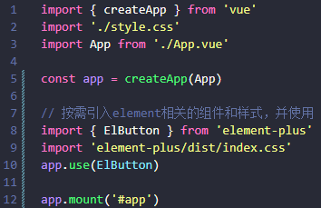
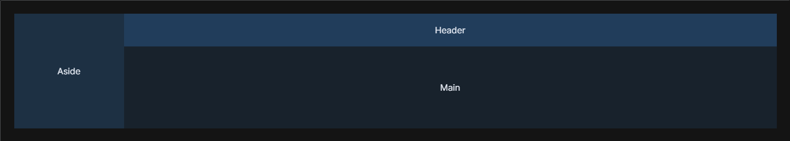

# 前言

欢迎阅读本文档！本文档旨在介绍作为初学者如何开发的人力资源后台管理系统项目，同时提供开发思路和技术实现细节。

**项目概述**

开发的目标是打造一款功能较为完善、易于使用的后台管理系统，以满足公司内部各部门对于管理和数据处理的基本需求。该系统允许用户通过登录不同的账号来访问，不同的账号拥有不同的身份和权限。身份权限主要包括总经理、各部门负责人以及各部门员工。总经理拥有系统内所有权限，而不同部门负责人和员工则根据其职责和需要具有相应的权限，如员工考勤、人员管理、营收统计等。

**技术栈**

为了实现这一目标，我们采用了一系列现代化的前端技术和工具，包括 HTML、CSS、JavaScript、Node、Axios 以及 Vue3、VueRouter4、Pinia、 Element Plus 和 git 等。这些技术的选择是基于它们在前端开发中的广泛应用、稳定性和灵活性等优势。

**祝愿**

在本文档中，将较为详细介绍开发流程、技术选型、系统功能实现方法以及部署和使用指南。希望通过这份文档，能够为其他开发者提供一些有价值的经验和思路，帮助他们更好地开发类似的项目。

感谢您阅读本文档，希望它能够为您的开发工作提供一些帮助和启发！

# 项目配置

在开始项目开发之前，需要配置和准备好开发环境。本节将介绍如何设置项目所需的开发工具、依赖项和相关环境。

**环境准备**

首先，确保您的开发环境满足以下基本要求：

-   **Node.js：** 确保您已安装 Node.js 运行时环境。您可以从 [Node.js 官方网站](https://nodejs.org/) 下载并安装适用于您操作系统的版本。
-   **pnpm：** 项目依赖管理工具选择pnpm。请确保 Node.js 已正确安装，npm 将与 Node.js 一同安装。然后通npm来下载pnpm

### 一、搭建Vite项目

参考：[开始 | Vite 官方中文文档 (vitejs.cn)](https://vitejs.cn/vite3-cn/guide/#scaffolding-your-first-vite-project)

第一步：

```
pnpm create vite // 在终端中输入这段代码
```

搭建Vite项目

第二步：

按照提示操作即可，示例如下：


> [!NOTE]
>
> 需要安装项目的依赖项，项目才能正常运行。
>
> 在终端运行`pnpm i`下载项目依赖的`node_modules`文件夹

### 二、配置eslint

参考：[ESLint 入门 - ESLint - 插件化的 JavaScript 代码检查工具](https://zh-hans.eslint.org/docs/latest/use/getting-started)

> [!NOTE]
>
> 使用eslint的目的是在于，根据开发需求进行规范配置，帮助团队维持一致的代码风格，并且可以在代码编写过程中提供实时反馈

第一步：

```
pnpm i eslint -D // 在终端中输入这段代码，先别着急，这段代码需要修改，在下面会说
```

第二步：

```
npm init @eslint/config // 在终端中输入这段代码
```

运行完这段，你的目录下会有 `.eslintrc.{js,yml,json}` 文件

第三步：

```
pnpm install -D eslint-plugin-import eslint-plugin-vue eslint-plugin-node eslint-plugin-prettier eslint-config-prettier eslint-plugin-node @babel/eslint-parser // 在终端中输入这段代码
```

下载相关插件

第四步：

将你的目录下会有 `.eslintrc.{js,yml,json}` 文件内容修改为如下的内容：（这个配置可以根据需求进行自定义）

```
// @see https://eslint.bootcss.com/docs/rules/

module.exports = {
  env: {
    browser: true,
    es2021: true,
    node: true,
    jest: true,
  },
  /* 指定如何解析语法 */
  parser: 'vue-eslint-parser',
  /** 优先级低于 parse 的语法解析配置 */
  parserOptions: {
    ecmaVersion: 'latest',
    sourceType: 'module',
    parser: '@typescript-eslint/parser',
    jsxPragma: 'React',
    ecmaFeatures: {
      jsx: true,
    },
  },
  /* 继承已有的规则 */
  extends: [
    'eslint:recommended',
    'plugin:vue/vue3-essential',
    'plugin:@typescript-eslint/recommended',
    'plugin:prettier/recommended',
  ],
  plugins: ['vue', '@typescript-eslint'],
  /*
   * "off" 或 0    ==>  关闭规则
   * "warn" 或 1   ==>  打开的规则作为警告（不影响代码执行）
   * "error" 或 2  ==>  规则作为一个错误（代码不能执行，界面报错）
   */
  rules: {
    // eslint（https://eslint.bootcss.com/docs/rules/）
    'no-var': 'error', // 要求使用 let 或 const 而不是 var
    'no-multiple-empty-lines': ['warn', { max: 1 }], // 不允许多个空行
    'no-console': process.env.NODE_ENV === 'production' ? 'error' : 'off',
    'no-debugger': process.env.NODE_ENV === 'production' ? 'error' : 'off',
    'no-unexpected-multiline': 'error', // 禁止空余的多行
    'no-useless-escape': 'off', // 禁止不必要的转义字符

    // typeScript (https://typescript-eslint.io/rules)
    '@typescript-eslint/no-unused-vars': 'error', // 禁止定义未使用的变量
    '@typescript-eslint/prefer-ts-expect-error': 'error', // 禁止使用 @ts-ignore
    '@typescript-eslint/no-explicit-any': 'off', // 禁止使用 any 类型
    '@typescript-eslint/no-non-null-assertion': 'off',
    '@typescript-eslint/no-namespace': 'off', // 禁止使用自定义 TypeScript 模块和命名空间。
    '@typescript-eslint/semi': 'off',

    // eslint-plugin-vue (https://eslint.vuejs.org/rules/)
    'vue/multi-word-component-names': 'off', // 要求组件名称始终为 “-” 链接的单词
    'vue/script-setup-uses-vars': 'error', // 防止<script setup>使用的变量<template>被标记为未使用
    'vue/no-mutating-props': 'off', // 不允许组件 prop的改变
    'vue/attribute-hyphenation': 'off', // 对模板中的自定义组件强制执行属性命名样式
  },
}

```

第五步：

在项目目录下，新建`.eslintignore`文件，添加如下内容：

```
dist
node_modules
```

第六步：

在`package.json`文件的scripts配置项中添加如下代码：

```
"scripts": {
    "lint": "eslint src",
    "fix": "eslint src --fix",
}
```

> [!WARNING]
>
> 在第一步`pnpm i eslint -D`下载的eslint版本是9.0.0，在9.0.0的版本中，按照如上的步骤配置会报错（`pnpm run lint`不能正常运行），从 ESLint v9.0.0 开始，`.eslintrc` 配置格式已经被弃用（deprecated），取而代之的是 flat config（扁平配置）系统成为新的默认配置系统。
>
> 参考：[Bug: "Error: Could not find config file." · Issue #18287 · eslint/eslint (github.com)](https://github.com/eslint/eslint/issues/18287)
>
> 反正，9.0.0的版本就是用不了，然后就查看了之前的一个练习项目的`package.json`文件，如下图所示
>
> 
>
> 然后我运行了`pnpm i eslint@8.57.0 -D`，将eslint的版本降低到了8.57.0，然后`pnpm run lint`就能正常运行，能够检查代码了

### 三、配置prettier

> [!NOTE]
>
> prettier是代码格式化工具，配置它的目的是用于自动格式化代码，使其符合统一的风格规范

第一步：

```
pnpm install -D eslint-plugin-prettier prettier eslint-config-prettier
```

安装相关的插件

第二步：

将`prettierrc.json`文件，添加如下的规则：

```
{
  "singleQuote": true,
  "semi": false,
  "bracketSpacing": true,
  "htmlWhitespaceSensitivity": "ignore",
  "endOfLine": "auto",
  "trailingComma": "all",
  "tabWidth": 2
}
```

第三步：

将`prettierignore`文件添加如下的内容：

```
{
  "singleQuote": true,
  "semi": false,
  "bracketSpacing": true,
  "htmlWhitespaceSensitivity": "ignore",
  "endOfLine": "auto",
  "trailingComma": "all",
  "tabWidth": 2
}
```

按照上述的步骤配置完成之后，进行格式化代码之后，就会按照上面添加的规则进行格式化

### 四、配置styleLint

参考：[Home | Stylelint中文文档 | Stylelint中文网 (bootcss.com)](https://stylelint.bootcss.com/)

> [!NOTE]
>
> 配置styleLint的目的是规避 CSS 代码中的错误并保持一致的编码风格

第一步：

安装如下的依赖：

```
pnpm add sass sass-loader stylelint postcss postcss-scss postcss-html stylelint-config-prettier stylelint-config-recess-order stylelint-config-recommended-scss stylelint-config-standard stylelint-config-standard-vue stylelint-scss stylelint-order stylelint-config-standard-scss -D
```

第二步：

在项目目录下，新建一个`.stylelintrc.cjs`的配置文件，文件内容如下：

```
// @see https://stylelint.bootcss.com/

module.exports = {
  extends: [
    'stylelint-config-standard', // 配置stylelint拓展插件
    'stylelint-config-html/vue', // 配置 vue 中 template 样式格式化
    'stylelint-config-standard-scss', // 配置stylelint scss插件
    'stylelint-config-recommended-vue/scss', // 配置 vue 中 scss 样式格式化
    'stylelint-config-recess-order', // 配置stylelint css属性书写顺序插件,
    'stylelint-config-prettier', // 配置stylelint和prettier兼容
  ],
  overrides: [
    {
      files: ['**/*.(scss|css|vue|html)'],
      customSyntax: 'postcss-scss',
    },
    {
      files: ['**/*.(html|vue)'],
      customSyntax: 'postcss-html',
    },
  ],
  ignoreFiles: [
    '**/*.js',
    '**/*.jsx',
    '**/*.tsx',
    '**/*.ts',
    '**/*.json',
    '**/*.md',
    '**/*.yaml',
  ],
  /**
   * null  => 关闭该规则
   * always => 必须
   */
  rules: {
    'value-keyword-case': null, // 在 css 中使用 v-bind，不报错
    'no-descending-specificity': null, // 禁止在具有较高优先级的选择器后出现被其覆盖的较低优先级的选择器
    'function-url-quotes': 'always', // 要求或禁止 URL 的引号 "always(必须加上引号)"|"never(没有引号)"
    'no-empty-source': null, // 关闭禁止空源码
    'selector-class-pattern': null, // 关闭强制选择器类名的格式
    'property-no-unknown': null, // 禁止未知的属性(true 为不允许)
    'block-opening-brace-space-before': 'always', //大括号之前必须有一个空格或不能有空白符
    'value-no-vendor-prefix': null, // 关闭 属性值前缀 --webkit-box
    'property-no-vendor-prefix': null, // 关闭 属性前缀 -webkit-mask
    'selector-pseudo-class-no-unknown': [
      // 不允许未知的选择器
      true,
      {
        ignorePseudoClasses: ['global', 'v-deep', 'deep'], // 忽略属性，修改element默认样式的时候能使用到
      },
    ],
  },
}
```

第三步：

在项目目录下，新建一个`.stylelintignore`的忽略文件，文件内容如下：

```
/node_modules/*
/dist/*
/html/*
/public/*
```

第四步：

在`package.json`文件的scripts配置项中添加如下代码：

```
"scripts": {
    "format": "prettier --write \"./**/*.{html,vue,ts,js,json,md}\"",
    "lint:eslint": "eslint src/**/*.{ts,vue} --cache --fix",
    "lint:style": "stylelint src/**/*.{css,scss,vue} --cache --fix"
  },
```

### 五、配置husky

> [!NOTE]
>
> 配置husky的目的是利用其在代码提交之前触发git hook(git在客户端的钩子)，然后执行`pnpm run format`来自动的格式化我们的代码

第一步：

```
pnpm install -D husky
```

安装husky

第二步：

```
npx husky-init
```

执行完这段代码，会生成一个`.husky`的文件夹，该文件夹下有一个`pre-commit`文件，这个文件在执行commit的时候会自动执行

第三步：

在`pre-commit`文件修改为如下：

```
#!/usr/bin/env sh
. "$(dirname -- "$0")/_/husky.sh"

pnpm run format

```

完成如上步骤，在进行commit操作时，会自动执行`pnpm run format`对代码进行格式化，之后再提交

### 六、配置commitLint

> [!NOTE]
>
> 配置commitLint的目的是在于统一commit的信息

第一步：

安装相关依赖

```
pnpm add @commitlint/config-conventional @commitlint/cli -D
```

第二步：

在项目目录下，新建`commitlint.config.cjs`文件，文件内容如下：

```
module.exports = {
  extends: ['@commitlint/config-conventional'],
  // 校验规则
  rules: {
    'type-enum': [
      2,
      'always',
      [
        'feat',
        'fix',
        'docs',
        'style',
        'refactor',
        'perf',
        'test',
        'chore',
        'revert',
        'build',
      ],
    ],
    'type-case': [0],
    'type-empty': [0],
    'scope-empty': [0],
    'scope-case': [0],
    'subject-full-stop': [0, 'never'],
    'subject-case': [0, 'never'],
    'header-max-length': [0, 'always', 72],
  },
}
```

第三步：

在`package.json`文件的scripts配置项中添加如下代码：

```
"scripts": {
  "commitlint": "commitlint --config commitlint.config.cjs -e -V"
},
```

第四步：

配置husky

```
npx husky add .husky/commit-msg
```

执行完这一步，会在`.husky`文件夹下面生成一个新的文件，名叫`commit-msg`

第五步：

在新的文件内容修改为如下：

```
#!/usr/bin/env sh
. "$(dirname -- "$0")/_/husky.sh"

pnpm commitlint

```

完成上述步骤之后，在进行commit时，需要携带如下关键字

```
'feat',//新特性、新功能
'fix',//修改bug
'docs',//文档修改
'style',//代码格式修改, 注意不是 css 修改
'refactor',//代码重构
'perf',//优化相关，比如提升性能、体验
'test',//测试用例修改
'chore',//其他修改, 比如改变构建流程、或者增加依赖库、工具等
'revert',//回滚到上一个版本
'build',//编译相关的修改，例如发布版本、对项目构建或者依赖的改动
```

### 七、配置统一包管理工具

第一步：

在项目目录下，新建文件夹`scripts`，文件夹下新建文件`preinstall.js`文件，文件内容如下：

```
if (!/pnpm/.test(process.env.npm_execpath || '')) {
  console.warn(
    `\u001b[33mThis repository must using pnpm as the package manager ` +
    ` for scripts to work properly.\u001b[39m\n`,
  )
  process.exit(1)
}
```

第二步：

在`package.json`文件的scripts配置项中添加如下代码：

```
"scripts": {
	"preinstall": "node ./scripts/preinstall.js"
}
```

### 八、集成element-plus

参考：[安装 | Element Plus (element-plus.org)](https://element-plus.org/zh-CN/guide/installation.html)

第一步：

下载element-plus

```
pnpm install element-plus @element-plus/icons-vue
```

第二步：

按需引入element-plus相关的组件时，需要进行额外的插件

```
npm install -D unplugin-vue-components unplugin-auto-import
```

将下列代码插入到Vite的配置文件`vite.config.ts`中

```
import { defineConfig } from 'vite'
import AutoImport from 'unplugin-auto-import/vite'
import Components from 'unplugin-vue-components/vite'
import { ElementPlusResolver } from 'unplugin-vue-components/resolvers'

export default defineConfig({
  // ...
  plugins: [
    // ...
    AutoImport({
      resolvers: [ElementPlusResolver()],
    }),
    Components({
      resolvers: [ElementPlusResolver()],
    }),
  ],
})
```

> [!NOTE]
>
> 如何按需引入组件并使用呢？
>
> 示例：
>
> 
>
> 

### 九、配置src文件夹别名

第一步：

将下列代码插入到Vite的配置文件`vite.config.ts`中：

```
// vite.config.ts
import {defineConfig} from 'vite'
import vue from '@vitejs/plugin-vue'
import path from 'path' // 这里
export default defineConfig({
    plugins: [vue()],
    // 还有这里
    resolve: {
        alias: {
            "@": path.resolve("./src") // 相对路径别名配置，使用 @ 代替 src
        }
    }
})
```

第二步：

将下列代码插入到`tsconfig.json`文件中：

```
// tsconfig.json
{
  "compilerOptions": {
    "baseUrl": "./", // 解析非相对模块的基地址，默认是当前目录
    "paths": { //路径映射，相对于baseUrl
      "@/*": ["src/*"]
    }
  }
}
```

### 十、集成sass

> [!NOTE]
>
> 在配置styleLint时，已经安装了sass和sass-loader

我们已经集成了sass，下面我们将引入一些全局样式

第一步：

在`src`文件夹，下面新建文件夹`styles`，新建`index.scss`、`reset.scss`和`variable.scss`文件

第二步：

将[scss-reset - npm (npmjs.com)](https://www.npmjs.com/package/scss-reset?activeTab=code)的文件内容引入到`reset.scss`文件里

第三步：

在`index.scss`文件中添加如下代码：

```
@import reset.scss
```

第四步：

在`main.ts`文件中添加如下代码：

```
// 引入全局样式
import '@/styles/index.scss'
```

> [!NOTE]
>
> 在index.scss文件中，还无法使用全局样式变量，我们需要进行如下步骤：
>
> 将下列代码插入到Vite的配置文件`vite.config.ts`中：
>
> ```
> export default defineConfig({
> 	css: {
> 		preprocessorOptions: {
> 			scss: {
> 				javascriptEnabled: true,
>             	additionalData: '@import "./src/styles/variable.scss";',
>           	},
>         },
> 	},
> })
> ```

### 十一、对axios进行二次封装

第一步：

```
pnpm i axios
```

第二步：

在`src`文件夹下创建`utils`文件夹，再创建`request`文件，文件内容如下：

```
// 对axios进行二次封装

import axios from 'axios'

// 引入element-plus的组件
import { ElMessage } from 'element-plus'

// 引入user仓库，判断是否包含token
import useUserStore from '@/store/modules/user.ts'

const request = axios.create({
  baseURL: import.meta.env.VITE_APP_BASE_API,
  timeout: 5000,
})

// 请求拦截器
request.interceptors.request.use((config) => {
  const userStore = useUserStore()
  // 判断仓库是否有token，有则配置每个请求带有token
  if (userStore.token) {
    config.headers.token = userStore.token
  }
  return config
})

// 响应拦截器
request.interceptors.response.use(
  // 响应成功回调
  (response) => {
    // 用于处理（简化数据）请求返回的数据
    return response.data
  },
  // 响应失败回调
  (error) => {
    ElMessage({
      type: 'error',
      message: '请求错误',
    })
    return Promise.reject(error)
  },
)

export default request

```

### 十二、配置环境变量

第一步：

在项目目录下，创建文件`.env.development`，文件内容如下：

```
# 变量必须以 VITE_ 为前缀才能暴露给外部读取
NODE_ENV = 'development'
VITE_APP_TITLE = '人力资源后台管理系统'
VITE_APP_BASE_API = '/dev-api'
VITE_SERVE = 'http://xxx.com'
```

第二步：

在项目目录下，创建文件`.env.production`，文件内容如下：

```
NODE_ENV = 'production'
VITE_APP_TITLE = '人力资源后台管理系统'
VITE_APP_BASE_API = '/prod-api'
VITE_SERVE = 'http://yyy.com'
```

第三步：

在项目目录下，创建文件`.env.test`，文件内容如下：

```
NODE_ENV = 'test'
VITE_APP_TITLE = '人力资源后台管理系统'
VITE_APP_BASE_API = '/test-api'
VITE_SERVE = 'http://zzz.com'
```

第四步：

在`package.json`文件的scripts配置项中添加如下代码：

```
 "scripts": {
    "build:test": "vue-tsc && vite build --mode test",
    "build:pro": "vue-tsc && vite build --mode production",
  },
```

完成如上配置，即可通过import.meta.env来获取环境变量

### 十三、配置mock

参考：[vite-plugin-mock/README.zh_CN.md at main · vbenjs/vite-plugin-mock (github.com)](https://github.com/vbenjs/vite-plugin-mock/blob/main/README.zh_CN.md)和[vite-plugin-mock - npm (npmjs.com)](https://www.npmjs.com/package/vite-plugin-mock/v/2.9.6)

第一步：

```
pnpm install -D vite-plugin-mock@2.9.6 mockjs
```

下载相关的插件

第二步：

将下列代码插入到Vite的配置文件`vite.config.ts`中：

```
import { viteMockServe } from 'vite-plugin-mock'

export default ({ command })=> {
  return {
    plugins: [
      vue(),
      viteMockServe({
        localEnabled: command === 'serve',
      }),
    ],
  }
}
```

第三步：

在项目目录下（和src文件夹同级）创建一个mock的文件夹，创建一个user.ts的文件，文件内容如下：

```
//用户信息数据
function createUserList() {
    return [
        {
            userId: 1,
            avatar:
                'https://wpimg.wallstcn.com/f778738c-e4f8-4870-b634-56703b4acafe.gif',
            username: 'admin',
            password: '111111',
            desc: '平台管理员',
            roles: ['平台管理员'],
            buttons: ['cuser.detail'],
            routes: ['home'],
            token: 'Admin Token',
        },
        {
            userId: 2,
            avatar:
                'https://wpimg.wallstcn.com/f778738c-e4f8-4870-b634-56703b4acafe.gif',
            username: 'system',
            password: '111111',
            desc: '系统管理员',
            roles: ['系统管理员'],
            buttons: ['cuser.detail', 'cuser.user'],
            routes: ['home'],
            token: 'System Token',
        },
    ]
}

export default [
    // 用户登录接口
    {
        url: '/api/user/login',//请求地址
        method: 'post',//请求方式
        response: ({ body }) => {
            //获取请求体携带过来的用户名与密码
            const { username, password } = body;
            //调用获取用户信息函数,用于判断是否有此用户
            const checkUser = createUserList().find(
                (item) => item.username === username && item.password === password,
            )
            //没有用户返回失败信息
            if (!checkUser) {
                return { code: 201, data: { message: '账号或者密码不正确' } }
            }
            //如果有返回成功信息
            const { token } = checkUser
            return { code: 200, data: { token } }
        },
    },
    // 获取用户信息
    {
        url: '/api/user/info',
        method: 'get',
        response: (request) => {
            //获取请求头携带token
            const token = request.headers.token;
            //查看用户信息是否包含有次token用户
            const checkUser = createUserList().find((item) => item.token === token)
            //没有返回失败的信息
            if (!checkUser) {
                return { code: 201, data: { message: '获取用户信息失败' } }
            }
            //如果有返回成功信息
            return { code: 200, data: {checkUser} }
        },
    },
]
```

### 十四、api接口统一管理

第一步：

在`src`文件夹下创建`api`文件夹，用来统一管理项目的接口

示例：


### 十五、配置vue-router

参考：[入门 | Vue Router (vuejs.org)](https://router.vuejs.org/zh/guide/)和[手摸手，带你用vue撸后台 系列二(登录权限篇) - 掘金 (juejin.cn)](https://juejin.cn/post/6844903478880370701)

第一步：

下载vue-router

```
pnpm add vue-router@4
```

第二步：

在`src`文件夹下新建文件夹`router`，同时新建两个文件`index.ts`和`routes.ts`（用于存放所有权限通用路由表和动态需要根据权限加载的路由表）

`routes.ts`文件示例：

```
// 存放所有权限通用路由表

export const constantRouterMap = [
  {
    path: '/login',
    component: () => import('@/views/login/index.vue'),
    name: 'login',
  },
  {
    path: '/',
    component: () => import('@/layout/index.vue'),
    name: 'layout',
    redirect: '/home',
    children: [
      {
        path: '/home',
        component: () => import('@/views/home/index.vue'),
      },
      {
        path: '/salary',
        component: () => import('@/views/salary/index.vue'),
      },
      {
        path: '/selfAttendance',
        component: () => import('@/views/selfAttendance/index.vue'),
      },
    ],
  },
]

// 存放需要根据权限动态加载的路由表
export const asyncRouterMap = [
  {
    path: '/',
    component: () => import('@/layout/index.vue'),
    name: 'layout',
    redirect: '/home',
    children: [
      {
        path: '/employee',
        component: () => import('@/views/employee/index.vue'),
        meta: { role: ['Manager', 'Minister'] },
      },
      {
        path: '/finance',
        component: () => import('@/views/finance/index.vue'),
        meta: { role: ['Manager', 'Finance'] },
      },
      {
        path: '/attendance',
        component: () => import('@/views/attendance/index.vue'),
        meta: { role: ['Manager', 'Attendance'] },
      },
      {
        path: '/operation',
        component: () => import('@/views/operation/index.vue'),
        meta: { role: ['Manager', 'Operation'] },
      },
      {
        path: '/authority',
        component: () => import('@/views/authority/index.vue'),
        meta: { role: ['Manager'] },
      },
    ],
  },
]

```

`index.te`文件示例：

```
import { createRouter, createWebHashHistory } from 'vue-router'
import { constantRouterMap } from './routes'

// 引入nprogress
import nprogress from 'nprogress'
import 'nprogress/nprogress.css'

// 免登录白名单
const whiteList = ['/login', '/404']

// 引入user仓库
import useUserStore from '@/store/modules/user'

// 引入permission方法
import { hasPermission } from '@/utils/permission.ts'

// 创建路由
const router = createRouter({
  history: createWebHashHistory(),
  routes: constantRouterMap,
  scrollBehavior() {
    return {
      left: 0,
      top: 0,
    }
  },
})

// 全局前置路由
router.beforeEach(async (to, from, next) => {
  const userStore = useUserStore()
  nprogress.start()
  if (userStore.token) {
    // 第一层判断：token值存在
    if (userStore.info.avatar === '' || userStore.info.userName === '') {
      // 第二层判断：info未获取
      await userStore.userMessage()
    }
    if (to.path === '/login') {
      // 第三层判断：路由路径是登陆页面路径
      next('/')
    } else {
      // 第三层判断：路由路径不是登陆页面路径
      if (to.meta && to.meta.role) {
        // 第四层判断：页面需要权限
        if (hasPermission(userStore.info.roles, to)) {
          // 第五层：有权限
          next()
        } else {
          // 第五层判断：无权限
          next('/404')
        }
      } else {
        // 第三层判断：页面不需要权限
        next()
      }
    }
  } else {
    // 第一层判断：token值不存在
    if (whiteList.includes(to.path)) {
      // 第二层判断：路由路径在免登录白名单上
      next()
    } else {
      // 第二层登录：登录路径不在免登录白名单上
      next('/login')
    }
  }
})

// 全局后置路由
router.afterEach(() => {
  nprogress.done()
})

// 导出router
export default router

```

第三步：

在`main.ts`文件中，加入如下内容：

```
// 引入路由
import router from './router'
app.use(router)
```

### 十六、配置pinia

参考：[简介 | Pinia (vuejs.org)](https://pinia.vuejs.org/zh/introduction.html)

第一步：

```
pnpm i pinia
```

安装pinia

第二步：

在`src`文件夹下创建`store`文件夹，同时在该文件夹下创建`index.ts`文件，文件内容如下：

```
import { createPinia } from 'pinia'

const pinia = createPinia()

export default pinia

```

第三步：

在`store`文件夹下创建`modules`文件夹，存放各个模块的仓库

第四步：

在`main.ts`文件添加如下内容：

```
// 引入仓库
import pinia from './store'
app.use(pinia)
```

### 十七、配置js-cookie

第一步：

```
pnpm i js-cookie
```

下载js-cookie

第二步：

在utils文件夹下新建一个文件`auth.ts`，用来封装读取、修改和删除用户的token，将token存储在cookie，新建的文件内容如下：

```
import Cookies from 'js-cookie'

const TokenKey = 'vue_admin_template_token'

export function getToken() {
  return Cookies.get(TokenKey)
}

export function setToken(token: any) {
  return Cookies.set(TokenKey, token)
}

export function removeToken() {
  return Cookies.remove(TokenKey)
}

```

### 十八、配置svg

第一步：

```
pnpm install vite-plugin-svg-icons -D
```

安装依赖

第二步：

将下列代码插入到Vite的配置文件`vite.config.ts`中

```
import { createSvgIconsPlugin } from 'vite-plugin-svg-icons'  // 这部分内容
export default () => {
  return {
    plugins: [
      // 这部分内容
      createSvgIconsPlugin({
        // Specify the icon folder to be cached
        iconDirs: [path.resolve(process.cwd(), 'src/assets/icons')],
        // Specify symbolId format
        symbolId: 'icon-[dir]-[name]',
      }),
    ],
  }
}
```

第三步：

在`main.ts`文件中添加如下代码：

```
import 'virtual:svg-icons-register'
```

示例：

第一步：

在`src/assest/icons`创建`logo.svg`文件，到[iconfont-阿里巴巴矢量图标库](https://www.iconfont.cn/)复制svg的代码到这个文件里面，在需要使用的地方，编写如下的代码

```
<svg style="width: 30px; height: 30px">
	<use xlink:href="#icon-logo"></use>
</svg>
```

href属性值需要是`#icon-logo`，其中logo是svg文件名


# 权限验证

### 前言

后台管理系统通常非常看重权限验证，因为它涉及到对系统中不同功能和数据的访问权限控制，确保只有授权用户才能进行相应的操作。

**该如何实现权限校验呢，从一下方面出发**

-   用户数据
-   permission工具类
-   全局前置路由守卫
-   请求拦截器
-   pinia仓库
-   路由表

**大概思路如下**

1.  用户在登录页面输入账号和密码，点击登录按钮。
2.  前端向后端发送登录请求，携带账号和密码信息。
3.  后端接收到请求，校验账号和密码的正确性。
4.  如果账号和密码正确，后端生成一个 token，并返回给前端。
5.  前端收到后端返回的 token，将 token 存储在 Cookie 中，以便后续的请求中使用。
6.  在二次封装 axios 时，请求拦截器会检查 Cookie 或者 Local Storage 中是否存在 token。
7.  如果存在 token，则在请求头中添加 token，以确保后续的请求都携带了 token。
8.  前端路由跳转到首页。
9.  全局前置路由守卫开始工作，发现用户信息不存在于 Pinia 仓库中。
10.  前端调用 Pinia 仓库中获取用户信息的方法，并传入 token。
11.  Pinia 仓库中的方法向后端发送请求，携带 token，后端根据 token 查询用户信息，并返回给前端。
12.  前端收到用户信息后，将用户信息存储在 Pinia 仓库中，包括头像、名字、权限等。
13.  根据用户权限，前端过滤动态路由表，将符合用户权限的路由信息存储在 Pinia 仓库中。
14.  全局前置路由守卫中获取到用户信息和过滤后的动态路由表，然后使用 `router.addRoute()` 方法动态添加路由。
15.  首页页面通过路由器具有的路由，动态生成页面左侧的导航栏，只显示用户有权限访问的菜单项。
16.  用户可以根据左侧导航栏的菜单项进行页面跳转，系统会根据用户的权限限制访问的页面。

### 相关请求

>   [!NOTE]
>
>   本项目使用Mock模拟数据，来返回前端发送的请求

**登录请求**

当用户在输入完账号和密码之后，后端会返回用户相关的token，返回的数据如下：

```
{
  token: 'GeneralManager Token',
}
```

**获取用户信息请求**

当全局前置路由守卫发现在pinia仓库没有存储用户相关的信息时，会在全局前置路由守卫进行获取用户信息的请求，返回的数据如下：

```
{
  userId: 1,
  avatar:
    'https://wpimg.wallstcn.com/f778738c-e4f8-4870-b634-56703b4acafe.gif',
  username: 'Manager',
  password: '111111',
  desc: '总经理',
  roles: ['Manager'],
  token: 'GeneralManager Token',
}
```

然后，在pinia仓库中存储用户相关的信息。通过后端返回的数据，可以知道用户所具有的权限`roles: ['Manager']`（用户对应的权限数组）

### permission

该文件存放在`src/utils`文件夹下，文件内容如下：

```
// 校验用户是否具有访问这个路由的权限
// roles：用户身份
// routes：传入动态路由表中二级路由对象
export function hasPermission(roles: any, routes: any) {
  return roles.some((role: any) => {
    return routes.meta.role.includes(role)
  })
}
```

该方法需要传入roles和routes这两个参数。

roles是用户对应的权限数组，routes是一个路由对象。

在路由对象中通过meta标签来标示该页面能访问的权限，如`meta: { role: ['Manager','Minister'] }`表示该页面只有Manager或者Minister的权限才能有资格进入。

### 全局前置路由守卫

**程序流程图**


示例：

```
import { createRouter, createWebHashHistory } from 'vue-router'
import { constantRouterMap } from './routes'

// 引入nprogress
import nprogress from 'nprogress'
import 'nprogress/nprogress.css'

// 免登录白名单
const whiteList = ['/login', '/404']

// 引入user仓库
import useUserStore from '@/store/modules/user'

// 引入permission方法
import { hasPermission } from '@/utils/permission.ts'

// 创建路由
const router = createRouter({
  history: createWebHashHistory(),
  routes: constantRouterMap,
  scrollBehavior() {
    return {
      left: 0,
      top: 0,
    }
  },
})

// 全局前置路由
router.beforeEach(async (to, from, next) => {
  const userStore = useUserStore()
  nprogress.start()
  if (userStore.token) {
    // 第一层判断：token值存在
    if (userStore.info.avatar === '' || userStore.info.userName === '') {
      // 第二层判断：info未获取
      await userStore.userMessage()
      // 动态添加路由
      userStore.filterAsyncRouterMap.forEach((route: any) => {
        router.addRoute('layout', route)
      })
      // 最后加上404路由
      router.addRoute({
        path: '/:pathMatch(.*)*',
        component: () => import('@/views/404/index.vue'),
        name: '404',
        meta: { isHidden: true },
      })
    }
    if (to.path === '/login') {
      // 第三层判断：路由路径是登陆页面路径
      next('/')
    } else {
      // 第三层判断：路由路径不是登陆页面路径
      if (to.meta && to.meta.role) {
        // 第四层判断：页面需要权限
        if (hasPermission(userStore.info.roles, to)) {
          // 第五层：有权限
          next()
        } else {
          // 第五层判断：无权限
          next('/404')
        }
      } else {
        // 第三层判断：页面不需要权限
        next()
      }
    }
  } else {
    // 第一层判断：token值不存在
    if (whiteList.includes(to.path)) {
      // 第二层判断：路由路径在免登录白名单上
      next()
    } else {
      // 第二层登录：登录路径不在免登录白名单上
      next('/login')
    }
  }
})

// 全局后置路由
router.afterEach(() => {
  nprogress.done()
})

// 导出router
export default router

```

**说明**

在守卫中，根据用户的登录状态和权限信息，动态地添加路由、重定向到登录页或者跳转到404页面，从而实现了路由导航守卫的权限验证功能

**注意**

404页面需要在动态添加完其他路由之后，再进行添加

### 请求拦截器

配置请求拦截器的目的是在于，在每个请求头里面塞入token，让后端对请求进行权限验证，或者后端通过token来返回对应用户相关的信息（头像、名字、权限等）

示例：

```
// 请求拦截器
request.interceptors.request.use((config) => {
  const userStore = useUserStore()
  // 判断仓库是否有token，有则配置每个请求带有token
  if (userStore.token) {
    config.headers.token = userStore.token
  }
  return config
})
```

### pinia

在仓库中获取完用户具有的权限之后，要通过权限去过滤动态路由表

```
// 过滤动态路由表
const filterAsyncRouterMap = asyncRouterMap[0].children.filter(
(route) => {
  if (hasPermission(this.info.roles, route)) {
    return true
  }
  return false
},
)
```

### 路由

路由可以根据如下模版来写

```
// 存放所有权限通用路由表

export const constantRouterMap = [
  {
    path: '/login',
    component: () => import('@/views/login/index.vue'),
    meta: { isHidden: true },
    name: 'login',
  },
  {
    path: '/',
    component: () => import('@/layout/index.vue'),
    meta: { isHidden: true },
    name: 'layout',
    redirect: '/home',
    children: [
      {
        path: '/home',
        component: () => import('@/views/home/index.vue'),
        meta: { isHidden: false, title: '首页' },
      },
      {
        path: '/salary',
        component: () => import('@/views/salary/index.vue'),
        meta: { isHidden: false, title: '薪资' },
      },
      {
        path: '/selfAttendance',
        component: () => import('@/views/selfAttendance/index.vue'),
        meta: { isHidden: false, title: '出勤情况' },
      },
    ],
  },
]

// 存放需要根据权限动态加载的路由表
export const asyncRouterMap = [
  {
    path: '/',
    component: () => import('@/layout/index.vue'),
    name: 'layout',
    redirect: '/home',
    children: [
      {
        path: '/employee',
        component: () => import('@/views/employee/index.vue'),
        meta: { role: ['Manager', 'Minister'], isHidden: false, title: '员工' },
      },
      {
        path: '/finance',
        component: () => import('@/views/finance/index.vue'),
        meta: { role: ['Manager', 'Finance'], isHidden: false, title: '财务' },
      },
      {
        path: '/attendance',
        component: () => import('@/views/attendance/index.vue'),
        meta: {
          role: ['Manager', 'Attendance'],
          isHidden: false,
          title: '考勤',
        },
      },
      {
        path: '/operation',
        component: () => import('@/views/operation/index.vue'),
        meta: {
          role: ['Manager', 'Operation'],
          isHidden: false,
          title: '运营',
        },
      },
      {
        path: '/authority',
        component: () => import('@/views/authority/index.vue'),
        meta: { role: ['Manager'], isHidden: false, title: '权限' },
      },
    ],
  },
]

```

路由中存放着，存放所有权限通用路由表和需要根据权限动态加载的路由表。每个路由具有相对于的路由元信息，如`role: ['Manager']`，表明该路由需要Manager权限

# 登录页面

当用户在浏览器输入地址，全局前置路由守卫开始工作，发现在cookie没有存储用户相关的token值，便将页面跳转到登录页面

### 基础结构

页面效果图：


右侧为element plus的form表单组件

参考：[Form 表单 | Element Plus (element-plus.org)](https://element-plus.org/zh-CN/component/form.html)

### 表单

**校验**

表单在提交之前（即用户点击登录按钮之前），表单控件需要校验账号和密码（校验是否格式正确，是否输入）

**提交**

当用户点击登录按钮，发送请求，并进行路由跳转（跳转到首页）

# 页面布局

参考：[Container 布局容器 | Element Plus (element-plus.org)](https://element-plus.org/zh-CN/component/container.html)



### Aside

这部分又分为Logo和Menu两部分。

**Logo**

展示网站logo和标题

**Menu**

参考：[Menu 菜单 | Element Plus (element-plus.org)](https://element-plus.org/zh-CN/component/menu.html)

展示垂直菜单

需要将每一个菜单放到`el-scrollba`标签里面

### Header

### Main

这部分主要是展示的是二级路由组件
